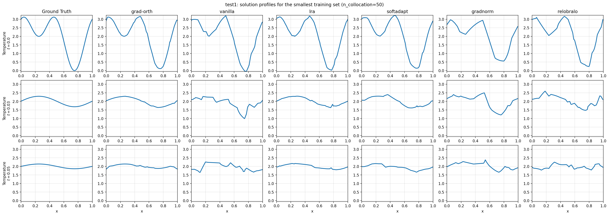
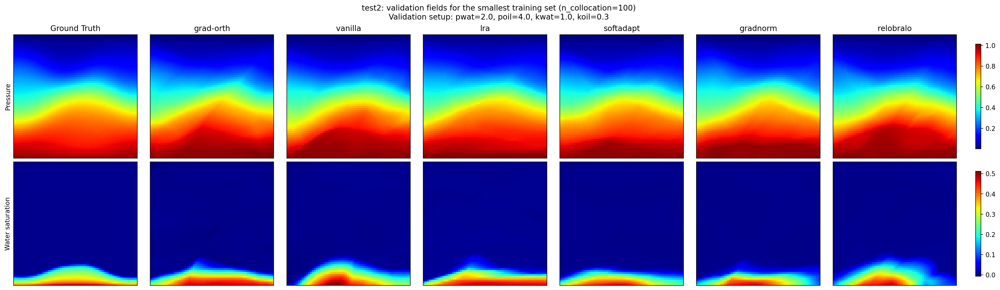
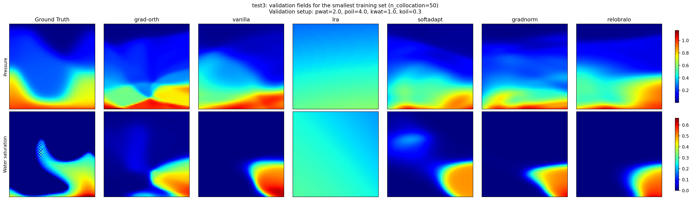
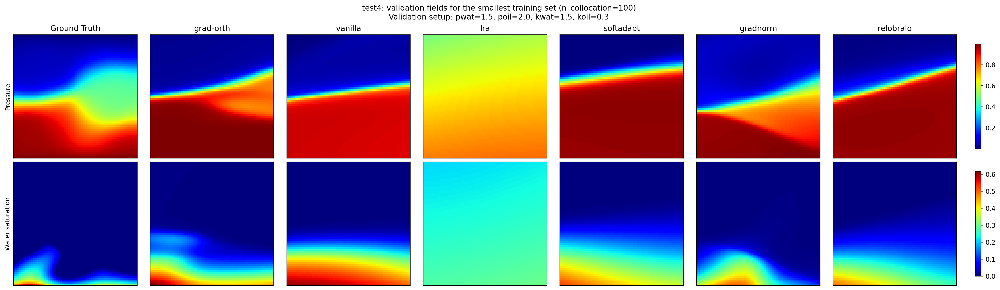

# Hierarchical Loss Weighting for Physics-Informed Neural Networks in Small-Data Regimes

This repository contains the code used to study hierarchical loss balancing for Physics-Informed Neural Networks (PINNs) in low-data settings: HO-PINN.

The main idea is to train PINNs with a staged weighting strategy that prioritizes:

1. data fitting,
2. boundary and initial condition enforcement,
3. PDE residual minimization.

The repository includes four benchmark problems, ablation scripts, test-evaluation pipelines, and the paper sources.

## Quick Start

After cloning the repository, install the Python dependencies:

```bash
python3 -m pip install -r requirements.txt
```

Then download and unpack the external dataset bundle:

```bash
bash scripts/download_data.sh
```

or

```bash
python3 scripts/download_data.py
```

After that, the training, ablation, and evaluation scripts can be run directly from the repository root.

To build comparison plots for the smallest available training set in `test1`, `test2`, `test3`, and `test4`, run:

```bash
python3 scripts/plot_min_n_validation_fields.py --device cpu
```

This command loads the saved PINN checkpoints, reconstructs the validation fields and 1D profiles, and stores the resulting figures in the root-level `graphs/` directory.

## Result Demonstration

The repository also includes ready-made comparison plots generated from the saved checkpoints for the smallest available training set in each benchmarks. 

These figures compare the ground-truth solution against all supported loss-balancing strategies using the smallest training sample size available in each test.

### Test 1



### Test 2



### Test 3



### Test 4



## Repository Structure

- `loss_balancong_algorithms/`: implementations of the loss balancers and runtime utilities.
- `benchmarking/`: shared utilities for ablations, metrics, plots, and reports.
- `test1-therm-conduct/`: 1D heat-conduction benchmark.
- `test2-2phase-disp-simple/`: 2D two-phase displacement with simpler nonlinearity.
- `test3-2phase-disp-perm-nonlinear/`: 2D two-phase displacement with stronger permeability nonlinearity.
- `test4-2phase-disp-7d/`: 7D parametric two-phase displacement benchmark.
- `test_results/`: cross-test held-out evaluation pipeline for trained PINNs.
- `test_ml_pinn/`: comparison pipeline for PINNs and classical ML baselines.

## Supported Loss Balancers

The training scripts support the following balancers:

- `grad-orth`: HO-PINN (our proposed hierarchical loss balancing).
- `vanilla`: fixed equal weights.
- `lra`: Learning Rate Annealing.
- `softadapt`: SoftAdapt.
- `gradnorm`: GradNorm.
- `relobralo`: ReLoBRaLo.

Core implementations are located in:

- `loss_balancong_algorithms/algos.py`
- `loss_balancong_algorithms/runtime.py`

## Benchmarks

### Test 1

`test1-therm-conduct/` solves a 1D heat equation with an analytical solution. This benchmark is mainly used to study optimization behavior in a controlled setting.

Typical command:

```bash
python3 test1-therm-conduct/train_pinn.py \
  --balancer grad-orth \
  --epochs 20000 \
  --n-collocation 500 \
  --device cpu
```

Prepared `N` values used in the project:

- `50`
- `100`
- `200`
- `500`
- `1000`
- `5000`

### Test 2

`test2-2phase-disp-simple/` contains a 2D two-phase porous-media flow problem with moderate nonlinearity.

Typical command:

```bash
python3 test2-2phase-disp-simple/train_pinn.py \
  --balancer relobralo \
  --epochs 20000 \
  --n-collocation 1000 \
  --device cpu
```

Prepared `N` values:

- `100`
- `200`
- `500`
- `1000`
- `2000`

### Test 3

`test3-2phase-disp-perm-nonlinear/` extends Test 2 with stronger nonlinear permeability effects and batched training.

Typical command:

```bash
python3 test3-2phase-disp-perm-nonlinear/train_pinn.py \
  --balancer grad-orth \
  --epochs 5000 \
  --n-collocation 500 \
  --batch-size 150 \
  --device cpu
```

Prepared `N` values:

- `50`
- `100`
- `200`
- `500`
- `1000`
- `2000`

### Test 4

`test4-2phase-disp-7d/` is the hardest benchmark. It extends the two-phase displacement setting to a 7D parametric problem with varying physical parameters.

Typical command:

```bash
python3 test4-2phase-disp-7d/train_pinn.py \
  --balancer grad-orth \
  --epochs 20000 \
  --n-collocation 500 \
  --device cpu
```

Prepared train-index sizes:

- `100`
- `200`
- `500`
- `1000`

## Common Training Interface

All benchmark training scripts expose a similar CLI:

```bash
python3 <path/to/train_pinn.py> \
  --balancer <grad-orth|vanilla|lra|softadapt|gradnorm|relobralo> \
  --epochs <EPOCHS> \
  --n-collocation <N> \
  --device <DEVICE>
```

Common device options:

- `cpu`
- `cuda`
- `cuda:0`
- `mps`

Common balancer-related arguments:

- `--lra-alpha`
- `--softadapt-beta`
- `--softadapt-use-relative` / `--no-softadapt-use-relative`
- `--gradnorm-alpha`
- `--gradnorm-lr`
- `--relobralo-alpha`
- `--relobralo-rho`
- `--relobralo-temperature`

Most training runs save:

- the best checkpoint,
- the last checkpoint,
- per-epoch metrics,
- a run summary JSON.

## Ablation Studies

Each benchmark directory contains a `run_ablation.py` script that trains multiple balancers across multiple training-set sizes and collects the results into `ablation_results/`.

Typical usage:

```bash
python3 test1-therm-conduct/run_ablation.py \
  --balancers vanilla grad-orth relobralo \
  --n-values 50 100 200 500 \
  --epochs 5000 \
  --device cpu
```

For each benchmark, additional helper scripts are provided:

- `plot_ablation_results.py`
- `build_ablation_table.py`

These scripts generate:

- metric plots across balancers and training sizes,
- runtime plots,
- aggregated CSV tables,
- Markdown/LaTeX-friendly summaries.

## Held-Out Testing

The repository includes two higher-level evaluation pipelines:

### PINN-only testing

```bash
python3 test_results/generate_test_results.py
```

This evaluates trained PINN checkpoints on held-out test selections and produces:

- detailed per-run test metrics,
- aggregated `mean ± std` tables,
- plots across training-set sizes.

### ML vs PINN testing

```bash
bash test_ml_pinn/run_test_ml_pinn.sh
```

This pipeline:

- loads trained PINN checkpoints,
- trains classical ML baselines on the same training points,
- evaluates all models on the same held-out test selections,
- generates comparison tables and plots.

The classical ML baselines currently include:

- `XGB`
- `SVM`
- `GP`

### Downloading the dataset bundle

The dataset bundle is hosted externally on Google Drive. The helper scripts below download the archive and unpack it into the repository root while preserving the benchmark directory structure expected by the code:

```bash
bash scripts/download_data.sh
```

or

```bash
python3 scripts/download_data.py
```

The scripts use the Google Drive file:

`https://drive.google.com/file/d/128_J3kojPXMWCEN54gbf86H0aSVxO_cI/view?usp=sharing`

They download the archive as `hierarchical-loss-pinn-data.zip`, extract it into the current repository, and remove the temporary archive afterwards.

### Minimal setup sequence

For a fresh clone, the expected order is:

```bash
git clone https://github.com/kirillkatsuba/hierarchical-loss-pinn.git
cd hierarchical-loss-pinn
python3 -m pip install -r requirements.txt
bash scripts/download_data.sh
```

After this setup, the main scripts should be ready to run.

## Notes

- The codebase mixes training scripts, paper-generation utilities, and experimental pipelines. It is primarily organized for reproducibility of the study rather than as a packaged Python library.
- Some benchmark scripts expect pre-generated training indices or raw simulation files. If these files are missing, the corresponding scripts may fail until the required local data is restored.


## Example of PINNs training
